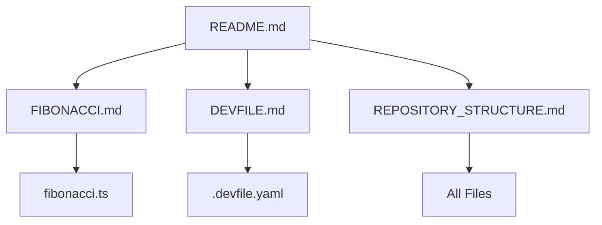

# Repository Structure Documentation

## 📋 Table of Contents

- [Overview](#overview)
- [Directory Structure](#directory-structure)
- [File Descriptions](#file-descriptions)
- [Documentation Structure](#documentation-structure)
- [Version Control](#version-control)
- [File Relationships](#file-relationships)
- [Adding New Files](#adding-new-files)
- [Maintenance Guide](#maintenance-guide)

## 🔍 Overview

The test-bms repository follows a simple, organized structure designed for clarity and ease of maintenance. This document provides a comprehensive guide to understanding how the repository is organized and where to find specific information.

## 📁 Directory Structure

```
test-bms/
│
├── .git/                          # Git version control directory
│   ├── config                     # Repository configuration
│   ├── HEAD                       # Current branch reference
│   ├── objects/                   # Git objects (commits, blobs, trees)
│   ├── refs/                      # Branch and tag references
│   └── ...                        # Other Git internal files
│
├── docs/                          # Detailed documentation directory
│   ├── DEVFILE.md                # .devfile.yaml detailed documentation
│   ├── FIBONACCI.md              # fibonacci.ts detailed documentation
│   └── REPOSITORY_STRUCTURE.md   # This file
│
├── .devfile.yaml                  # Development environment configuration
├── fibonacci.ts                   # TypeScript Fibonacci generator
└── README.md                      # Main project documentation
```

### Tree View

```
test-bms/
│
├── 📄 README.md                   [Main Documentation]
├── 📄 .devfile.yaml               [Dev Environment Config]
├── 📄 fibonacci.ts                [TypeScript Source Code]
│
└── 📁 docs/
    ├── 📄 FIBONACCI.md            [Fibonacci Code Details]
    ├── 📄 DEVFILE.md              [Devfile Details]
    └── 📄 REPOSITORY_STRUCTURE.md [This Document]
```

## 📄 File Descriptions

### Root Level Files

#### README.md

- **Type**: Markdown Documentation
- **Purpose**: Main entry point for project documentation
- **Size**: ~15KB
- **Audience**: All users (developers, contributors, users)
- **Contents**:
  - Project overview
  - Quick start guide
  - Usage examples
  - Links to detailed documentation
  - Contributing guidelines
- **When to Update**:
  - Adding new features
  - Changing setup process
  - Adding new files
  - Updating dependencies
- **Related Files**: All documentation in `docs/`

#### fibonacci.ts

- **Type**: TypeScript Source Code
- **Purpose**: Core implementation of Fibonacci sequence generator
- **Size**: ~3KB
- **Language**: TypeScript 5.x
- **Target**: ES2022+
- **Contents**:
  - `generateFibonacci()` function
  - JSDoc documentation
  - Usage examples (commented)
  - Input validation
  - Error handling
- **Exports**: `{ generateFibonacci }`
- **Dependencies**: None (pure TypeScript)
- **Generated Files**: 
  - `fibonacci.js` (after compilation)
  - `fibonacci.js.map` (if source maps enabled)
- **Documentation**: See `docs/FIBONACCI.md`

#### .devfile.yaml

- **Type**: YAML Configuration
- **Purpose**: Defines development environment
- **Size**: ~1KB
- **Format**: Devfile 2.2.0 specification
- **Contents**:
  - Container definitions (Node.js 18)
  - Build commands
  - Test commands
  - Startup events
- **Used By**:
  - Eclipse Che
  - OpenShift Dev Spaces
  - Podman Desktop
  - Other devfile-compatible tools
- **Documentation**: See `docs/DEVFILE.md`

### Documentation Directory (docs/)

#### FIBONACCI.md

- **Type**: Markdown Documentation
- **Purpose**: Comprehensive documentation for fibonacci.ts
- **Size**: ~20KB
- **Sections**:
  - Algorithm explanation
  - Mathematical background
  - Performance analysis
  - Usage patterns
  - Testing strategies
  - Advanced topics
- **Audience**: Developers wanting to understand or modify the code
- **Update Triggers**:
  - Changes to fibonacci.ts
  - New usage patterns discovered
  - Performance optimizations
  - Bug fixes

#### DEVFILE.md

- **Type**: Markdown Documentation
- **Purpose**: Complete reference for .devfile.yaml
- **Size**: ~25KB
- **Sections**:
  - Devfile concepts
  - Configuration reference
  - Usage guide
  - Customization options
  - Troubleshooting
  - Advanced configurations
- **Audience**: DevOps engineers, developers setting up environments
- **Update Triggers**:
  - Changes to .devfile.yaml
  - New commands added
  - Container updates
  - Environment changes

#### REPOSITORY_STRUCTURE.md

- **Type**: Markdown Documentation
- **Purpose**: Repository organization guide
- **Size**: ~10KB
- **Sections**:
  - Directory structure
  - File descriptions
  - Relationships
  - Maintenance guidelines
- **Audience**: New contributors, maintainers
- **Update Triggers**:
  - New files added
  - Structure changes
  - Organization updates

## 📚 Documentation Structure

### Documentation Hierarchy

```
Level 1: README.md
    │
    ├── Quick Overview
    ├── Getting Started
    └── Links to Details
         │
         └─→ Level 2: docs/*.md
                 │
                 ├── FIBONACCI.md (Code Deep Dive)
                 ├── DEVFILE.md (Config Deep Dive)
                 └── REPOSITORY_STRUCTURE.md (Organization)
```

### Documentation by Audience

| Audience | Start Here | Then Read |
|----------|-----------|-----------|
| **New User** | README.md | - |
| **Developer** | README.md → FIBONACCI.md | DEVFILE.md |
| **DevOps Engineer** | README.md → DEVFILE.md | - |
| **Contributor** | README.md → All docs/ | - |
| **Maintainer** | REPOSITORY_STRUCTURE.md | All docs/ |

### Documentation Relationships



## 🔄 Version Control

### Git Configuration

#### .gitignore (Recommended)

Create a `.gitignore` file to exclude generated files:

```gitignore
# Compiled JavaScript
*.js
*.js.map

# Node modules
node_modules/

# IDE files
.vscode/
.idea/
*.swp
*.swo

# OS files
.DS_Store
Thumbs.db

# Logs
*.log
npm-debug.log*

# Temporary files
*.tmp
.cache/
```

#### .gitattributes (Recommended)

Create a `.gitattributes` for consistent line endings:

```gitattributes
# Auto detect text files and normalize line endings to LF
* text=auto

# TypeScript files
*.ts text eol=lf

# YAML files
*.yaml text eol=lf
*.yml text eol=lf

# Markdown files
*.md text eol=lf

# Shell scripts
*.sh text eol=lf
```

### Branch Structure

```
main (or master)
    ├── feature/fibonacci-optimization
    ├── fix/type-check-error
    ├── docs/update-readme
    └── release/v1.1.0
```

### Commit Conventions

Recommended commit message format:

```
type(scope): subject

body (optional)

footer (optional)
```

**Types**:
- `feat`: New feature
- `fix`: Bug fix
- `docs`: Documentation changes
- `style`: Code style changes (formatting)
- `refactor`: Code refactoring
- `test`: Adding tests
- `chore`: Maintenance tasks

**Examples**:
```bash
feat(fibonacci): add BigInt support for large numbers
fix(devfile): correct TypeScript installation command
docs(readme): update usage examples
refactor(fibonacci): improve performance for large n
```

## 🔗 File Relationships

### Dependency Graph

```
.devfile.yaml
    └── Configures environment for
            ↓
        fibonacci.ts
            └── Compiles to
                    ↓
                fibonacci.js
```

### Documentation Relationships

```
README.md (Overview)
    ├── References → fibonacci.ts
    ├── References → .devfile.yaml
    ├── Links to → docs/FIBONACCI.md
    ├── Links to → docs/DEVFILE.md
    └── Links to → docs/REPOSITORY_STRUCTURE.md

docs/FIBONACCI.md
    └── Documents → fibonacci.ts

docs/DEVFILE.md
    └── Documents → .devfile.yaml

docs/REPOSITORY_STRUCTURE.md
    └── Documents → All files
```

### Functional Relationships

```
Developer
    ↓ (reads)
README.md
    ↓ (follows instructions)
.devfile.yaml
    ↓ (sets up environment)
Development Environment
    ↓ (compiles)
fibonacci.ts
    ↓ (produces)
fibonacci.js
    ↓ (executes)
Application Output
```

## ➕ Adding New Files

### When Adding Source Code

1. **Create the file** in appropriate location
2. **Add TypeScript configuration** if needed (tsconfig.json)
3. **Update .devfile.yaml** with build commands
4. **Create documentation** in `docs/` directory
5. **Update README.md** with new file information
6. **Add to .gitignore** if it's generated
7. **Commit with descriptive message**

**Example: Adding a new utility file**

```bash
# 1. Create file
touch utils.ts

# 2. Add content with proper documentation
# (write the code)

# 3. Update devfile to build it
# (edit .devfile.yaml)

# 4. Create documentation
touch docs/UTILS.md

# 5. Update main README
# (edit README.md)

# 6. Commit
git add utils.ts docs/UTILS.md README.md .devfile.yaml
git commit -m "feat(utils): add utility functions for Fibonacci calculations"
```

### When Adding Documentation

1. **Create file** in `docs/` directory
2. **Follow naming convention**: `UPPERCASE_WITH_UNDERSCORES.md`
3. **Include standard sections**:
   - Overview
   - Table of Contents
   - Detailed sections
   - Examples
   - References
4. **Link from README.md**
5. **Update REPOSITORY_STRUCTURE.md**
6. **Commit changes**

### When Adding Configuration

1. **Create configuration file** (e.g., `.eslintrc.json`)
2. **Document in README.md** or create dedicated doc
3. **Update .devfile.yaml** if environment needs it
4. **Add to version control**
5. **Consider adding .gitignore** entry if needed

## 🛠️ Maintenance Guide

### Regular Maintenance Tasks

#### Weekly

- [ ] Check for documentation accuracy
- [ ] Review open issues and PRs
- [ ] Test build and type-check commands
- [ ] Verify links in documentation

#### Monthly

- [ ] Update dependencies (TypeScript, Node.js)
- [ ] Review and update README.md
- [ ] Check for outdated documentation
- [ ] Update version numbers if needed
- [ ] Test in latest Eclipse Che/Dev Spaces

#### Quarterly

- [ ] Comprehensive documentation review
- [ ] Performance benchmarking
- [ ] Security audit
- [ ] Refactoring opportunities
- [ ] Update external links

### Documentation Maintenance

#### Keep Documentation in Sync

```bash
# When updating fibonacci.ts
1. Modify fibonacci.ts
2. Update docs/FIBONACCI.md
3. Update README.md if API changed
4. Update examples
5. Test all examples
6. Commit together
```

#### Documentation Review Checklist

- [ ] All code examples work
- [ ] No broken links
- [ ] Consistent terminology
- [ ] Up-to-date version numbers
- [ ] Accurate command outputs
- [ ] Proper formatting
- [ ] Table of contents updated
- [ ] Cross-references correct

### File Cleanup

#### Generated Files

```bash
# Clean compiled JavaScript
rm -f *.js *.js.map

# Clean logs
rm -f *.log

# Clean temporary files
rm -rf .cache/ tmp/
```

#### Periodic Cleanup

```bash
# Remove obsolete branches
git branch --merged | grep -v "main" | xargs git branch -d

# Remove obsolete documentation
# (manually review docs/ for outdated files)

# Update .gitignore
# (add new patterns as needed)
```

### Versioning Strategy

#### Semantic Versioning

```
MAJOR.MINOR.PATCH
  │     │     │
  │     │     └── Bug fixes
  │     └────────── New features (backwards compatible)
  └──────────────── Breaking changes
```

**Example**:
- `1.0.0`: Initial release
- `1.1.0`: Add BigInt support (new feature)
- `1.1.1`: Fix type check bug (patch)
- `2.0.0`: Change API (breaking change)

#### Version Tracking

Update version in:
1. `README.md` (if present)
2. `.devfile.yaml` metadata
3. `package.json` (if added)
4. Git tags

```bash
# Tag a release
git tag -a v1.0.0 -m "Release version 1.0.0"
git push origin v1.0.0
```

## 📊 File Statistics

### Current Repository Size

| Category | Files | Size |
|----------|-------|------|
| Source Code | 1 | ~3KB |
| Configuration | 1 | ~1KB |
| Documentation | 4 | ~60KB |
| **Total** | **6** | **~64KB** |

### Line Counts

```bash
# Source code
fibonacci.ts: 96 lines

# Configuration
.devfile.yaml: 46 lines

# Documentation
README.md: ~500 lines
docs/FIBONACCI.md: ~850 lines
docs/DEVFILE.md: ~1100 lines
docs/REPOSITORY_STRUCTURE.md: ~450 lines
```

## 🎯 Best Practices

### File Organization

1. **Keep it Simple**: Don't over-organize
2. **Consistent Naming**: Use clear, descriptive names
3. **Logical Grouping**: Related files together
4. **Documentation Close to Code**: Easy to find
5. **README at Root**: Always visible

### Documentation Standards

1. **Write for Your Audience**: Consider reader's knowledge
2. **Keep it Current**: Update with code changes
3. **Provide Examples**: Code examples are essential
4. **Link Generously**: Connect related documentation
5. **Use Visual Aids**: Diagrams, tables, code blocks

### Version Control Practices

1. **Atomic Commits**: One logical change per commit
2. **Descriptive Messages**: Clear commit messages
3. **Branch for Features**: Don't work directly on main
4. **Review Before Merge**: Code review process
5. **Tag Releases**: Version management

## 🔍 Finding Information

### Quick Reference

| I want to... | Look here |
|--------------|-----------|
| **Get started quickly** | README.md |
| **Understand the Fibonacci code** | docs/FIBONACCI.md |
| **Set up development environment** | docs/DEVFILE.md |
| **Understand repository layout** | docs/REPOSITORY_STRUCTURE.md (this file) |
| **See usage examples** | README.md or fibonacci.ts comments |
| **Learn about commands** | docs/DEVFILE.md |
| **Contribute** | README.md (Contributing section) |
| **Report issues** | GitHub Issues (if applicable) |

### Search Tips

```bash
# Find text in all files
grep -r "fibonacci" .

# Find text in specific file types
grep -r "fibonacci" --include="*.md"

# Find files by name
find . -name "*.ts"

# Count lines in documentation
wc -l docs/*.md
```

## 📋 Checklist for New Contributors

- [ ] Read README.md
- [ ] Understand fibonacci.ts functionality
- [ ] Review .devfile.yaml configuration
- [ ] Read relevant documentation in docs/
- [ ] Set up development environment
- [ ] Test build and type-check commands
- [ ] Make a small change and test
- [ ] Follow commit conventions
- [ ] Update documentation if needed
- [ ] Submit pull request

---

## 📝 Summary

The test-bms repository is organized for:

- ✅ **Clarity**: Easy to understand structure
- ✅ **Maintainability**: Well-documented and organized
- ✅ **Accessibility**: Information easy to find
- ✅ **Scalability**: Easy to extend with new files
- ✅ **Professionalism**: Follows best practices

### Key Takeaways

1. **Main README** provides overview and quick start
2. **docs/ directory** contains detailed documentation
3. **Each file is well-documented** in its own dedicated guide
4. **Clear relationships** between files
5. **Easy to maintain** and extend

For questions or suggestions about repository organization, please open an issue or contact the maintainers.

---

**Last Updated**: [Current Date]
**Repository Version**: 1.0.0
**Documentation Version**: 1.0.0
